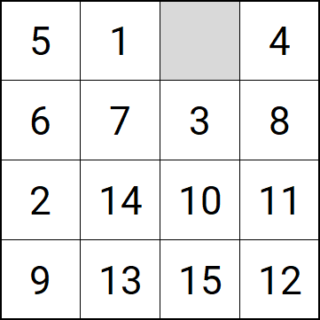

# Toteutusdokumentti

Projektin tarkoituksena on laatia ohjelma, joka ratkaisee perusmuotoisen sekä laajennetun 15-pelin.

## Ohjelman yleisrakenne
Luokka GamePosition kuvaa tiettyä pelitilannetta, eli numeroiden järjestystä pelilaudalla. GamePosition luokan olioon tallennetaan pelitilanteen lisäksi pelin ratkaisemiseen liittyvää tietoa. 

Ylläoleva pelitilanne voisi muodostaa pelin alkutilanteen. Luvut ja niiden järjestys tallennetaan GamePosition luokan 16 paikkaiseen kokonaislukutaulukkoon. Tyhjä kohta tallennetaan nollana. {5, 1, 0, 4, 6, 7, 3, 8, 2, 14, 10, 11, 9, 13, 15, 12}

Peli ratkaistaan A* tyyppisen algoritmin avulla. Pelin lähtötilanne on verkon ensimmäinen solmu. Jokaisesta tilanteesta voi tehdä enintään neljä mahdollista siirtoa (ylös, alas, oikea, vasen). Reunoissa siirtomahdollisuuksia on kolme ja nurkissa kaksi. Algoritmi käy mahdollisuudet läpi ja vertaa niitä keskenään. Käsiteltäväksi valitaan A* algoritmissa aina se solmu (pelitilanne), jossa f(n)=g(n)+h(n) on pienin. g(n) on lähtöpisteesta kuljettu matka ja h(n) on arvio kokonaismatkasta määränpäähän. 

Funktiona h(n) käytetään tässä sovelluksessa laskelmaa siitä kuinka monta askelta kukin numerolaatta pitäisi yhteensä siirtää jotta se olisi oikealla paikallaan (ns. Manhattan Distance).

Luokassa GameSolver on toteutettu pelin ratkaiseva algoritmi. GameSolver luokan search metodille annetaan lähtötilanteeksi GamePosition luokan olio. Search metodi käyttää hyväkseen kekorakennetta tallentaakseen läpikäydyt pelitilanteet. Käsittelyyn otetaan mahdollisista seuraavista pelitilanteista käsittelyyn aina paras vaihtoehto yllä kerrotun mukaisesti. 

## Oma tietorakenne GamePositionQueue
Minimikeko, joka tarjoaa seuraavaksi sen pelitilanteen, jossa kuljettu matka plus arvioitu jäljellä oleva matka on pienin. 

## Aika- ja tilavaativuudet 
Esimerkkinä ollut pelitilanne voidaan ratkaista 20 siirrolla. Algoritmi käytti 12 millisekuntia oikean ratkaisun löytämiseksi ja pelitilanteita on käyty läpi noin 1000. Jos h(n) kustannuslaskenta otetaan pois käytöstä, löytyy täsmälleen sama ratkaisu mutta ratkaisun löytäminen kestää 51 sekuntia kun pelitilanteita on käyty läpi yli 7 milj. 

Tämä kuvastaa miten tärkeä käytetty kustannusfunktio on aikavaativuuden kannalta. Pahimmillaan A* algoritmin aikavaativuus sanotaan olevan O(b^d), jossa b on "branching factor" eli jakautumiskerroin. Viisitoistapelissä jakautumiskerroin on käytännössä alle 3 (kun suljetaan pois mahdollisuus palata takaisin edelliseen tilanteeseen). Paras mahdollinen jakautumiskerroin on 1 (jos algoritmi aina löytää parhaan seuraavan siirron). Verkon syvyys d on 4x4 kokoisessa pelissä enintään 80 (Wikipedia). Esimerkkitapauksessa syvyys oli 20. 

GamePositionQueue noudattaa tunnettuja maksimikeon aika- ja tilavaativuuksia. 

## Työn mahdolliset puutteet ja parannusehdotukset

## Lähteet
Wikipedia, [A* Search Algortihm](https://en.wikipedia.org/wiki/A*_search_algorithm)

Antti Laaksonen, [Tirakirja](https://www.cs.helsinki.fi/u/ahslaaks/tirakirja/)

Wikipedia, [15 puzzle](https://en.wikipedia.org/wiki/15_puzzle)

